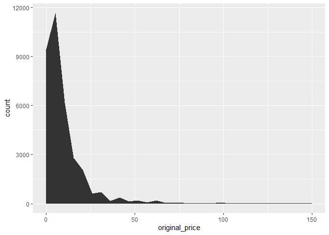

Welcome to your (maybe) first-ever data analysis project!
=========================================================

And hopefully the first of many. Let’s get started:

1.  Install the [`datateachr`](https://github.com/UBC-MDS/datateachr)
    package by typing the following into your **R terminal**:

<!-- -->

    # install.packages("devtools")
    # devtools::install_github("UBC-MDS/datateachr")

1.  Load the package below. While we are at it, let’s load the tidyverse
    too.

<!-- -->

    library(datateachr)
    library(tidyverse)

    ## -- Attaching packages ----------------------------------------------------------------------- tidyverse 1.3.0 --

    ## √ ggplot2 3.3.2     √ purrr   0.3.4
    ## √ tibble  3.0.3     √ dplyr   1.0.2
    ## √ tidyr   1.1.2     √ stringr 1.4.0
    ## √ readr   1.3.1     √ forcats 0.5.0

    ## -- Conflicts -------------------------------------------------------------------------- tidyverse_conflicts() --
    ## x dplyr::filter() masks stats::filter()
    ## x dplyr::lag()    masks stats::lag()

Instructions
============

The instructions and grading scheme for Milestone 1 can be found in
detail [here](). Briefly,

-   Each milestone is worth 30 points. The number of points allocated to
    each task will be annotated within each deliverable. Tasks that are
    more challenging will often be allocated more points.

-   10 points will be allocated to the reproducibility, cleanliness, and
    coherence of the analysis. While the three milestones will be
    submitted as independent deliverables, the analysis itself is a
    continuum - think of it as 3 chapters to a story. Each chapter, or
    in this case, portion of your analysis, should be easily followed
    through by someone unfamiliar with the content.
    [Here](https://swcarpentry.github.io/r-novice-inflammation/06-best-practices-R/)
    is a good resource for what constitutes “good code”. Learning good
    coding practices early in your career will save you hassle later on!

Learning Objectives
===================

By the end of this milestone, you should:

-   Become familiar with your dataset of choosing
-   Think of 4 questions that you would like to answer with your data
-   Generate a reproducible and clear report using R Markdown

Task 1: Choose your favorite dataset (10 points)
================================================

The `datateachr` package by Hayley Boyce and Jordan Bourak currently
composed of 7 semi-tidy datasets for educational purposes. Here is a
brief description of each dataset:

-   *apt\_buildings*: Acquired courtesy of The City of Toronto’s Open
    Data Portal. It currently has 3455 rows and 37 columns.

-   *building\_permits*: Acquired courtesy of The City of Vancouver’s
    Open Data Portal. It currently has 20680 rows and 14 columns.

-   *cancer\_sample*: Acquired courtesy of UCI Machine Learning
    Repository. It currently has 569 rows and 32 columns.

-   *flow\_sample*: Acquired courtesy of The Government of Canada’s
    Historical Hydrometric Database. It currently has 218 rows and 7
    columns.

-   *parking\_meters*: Acquired courtesy of The City of Vancouver’s Open
    Data Portal. It currently has 10032 rows and 22 columns.

-   *steam\_games*: Acquired courtesy of Kaggle. It currently has 40833
    rows and 21 columns.

-   *vancouver\_trees*: Acquired courtesy of The City of Vancouver’s
    Open Data Portal. It currently has 146611 rows and 20 columns.

**Things to keep in mind**

-   We hope that this project will serve as practice for carrying our
    your own *independent* data analysis. Remember to comment your code,
    be explicit about what you are doing, and write notes in this
    markdown document when you feel that context is required. As you
    advance in the project, prompts and hints to do this will be
    diminished - it’ll be up to you!

-   Before choosing a dataset, you should always keep in mind **your
    goal**, or in other ways, *what you wish to achieve with this data*.
    This mini data-analysis project focuses on *data wrangling*,
    *tidying*, and *visualization*. In short, it’s a way for you to get
    your feet wet with exploring data on your own.

And that is exactly the first thing that you will do!

1.1 Out of the 7 datasets available in the `datateachr` package, choose
**4** that appeal to you based on their description. Write your choices
below:

**Note**: We encourage you to use the ones in the `datateachr` package,
but if you have a dataset that you’d really like to use, you can include
it here. But, please check with a member of the teaching team to see
whether the dataset is of appropriate complexity. Also, include a
**brief** description of the dataset here to help the teaching team
understand your data.

1: building\_permits 2: cancer\_sample 3: steam\_games 4:
vancouver\_trees

1.2 One way to narrowing down your selection is to *explore* the
datasets. Use your knowledge of dplyr to find out at least *3*
attributes about each of these datasets (an attribute is something such
as number of rows, variables, class type…). The goal here is to have an
idea of *what the data looks like*.

*Hint:* This is one of those times when you should think about the
cleanliness of your analysis. I added a single code chunk for you, but
do you want to use more than one? Would you like to write more comments
outside of the code chunk?

1.  building\_permits

-   class type
-   variable names
-   number of rows

<!-- -->

    #building_permits
    class(building_permits)

    ## [1] "spec_tbl_df" "tbl_df"      "tbl"         "data.frame"

    variable.names(building_permits)

    ##  [1] "permit_number"               "issue_date"                 
    ##  [3] "project_value"               "type_of_work"               
    ##  [5] "address"                     "project_description"        
    ##  [7] "building_contractor"         "building_contractor_address"
    ##  [9] "applicant"                   "applicant_address"          
    ## [11] "property_use"                "specific_use_category"      
    ## [13] "year"                        "bi_id"

    nrow(building_permits)

    ## [1] 20680

2: cancer\_sample + class type + dimension of data + variable names

    #cancer_sample
    class(cancer_sample)

    ## [1] "spec_tbl_df" "tbl_df"      "tbl"         "data.frame"

    dim(cancer_sample)

    ## [1] 569  32

    variable.names(cancer_sample)

    ##  [1] "ID"                      "diagnosis"              
    ##  [3] "radius_mean"             "texture_mean"           
    ##  [5] "perimeter_mean"          "area_mean"              
    ##  [7] "smoothness_mean"         "compactness_mean"       
    ##  [9] "concavity_mean"          "concave_points_mean"    
    ## [11] "symmetry_mean"           "fractal_dimension_mean" 
    ## [13] "radius_se"               "texture_se"             
    ## [15] "perimeter_se"            "area_se"                
    ## [17] "smoothness_se"           "compactness_se"         
    ## [19] "concavity_se"            "concave_points_se"      
    ## [21] "symmetry_se"             "fractal_dimension_se"   
    ## [23] "radius_worst"            "texture_worst"          
    ## [25] "perimeter_worst"         "area_worst"             
    ## [27] "smoothness_worst"        "compactness_worst"      
    ## [29] "concavity_worst"         "concave_points_worst"   
    ## [31] "symmetry_worst"          "fractal_dimension_worst"

1.  steam\_games

-   class type
-   dimension of data
-   variable names

<!-- -->

    #steam_games
    class(steam_games)

    ## [1] "spec_tbl_df" "tbl_df"      "tbl"         "data.frame"

    dim(steam_games)

    ## [1] 40833    21

    variable.names(steam_games)

    ##  [1] "id"                       "url"                     
    ##  [3] "types"                    "name"                    
    ##  [5] "desc_snippet"             "recent_reviews"          
    ##  [7] "all_reviews"              "release_date"            
    ##  [9] "developer"                "publisher"               
    ## [11] "popular_tags"             "game_details"            
    ## [13] "languages"                "achievements"            
    ## [15] "genre"                    "game_description"        
    ## [17] "mature_content"           "minimum_requirements"    
    ## [19] "recommended_requirements" "original_price"          
    ## [21] "discount_price"

1.  vancouver\_trees

-   class type
-   dimension of data
-   variable names

<!-- -->

    #vancouver_trees
    class(vancouver_trees)

    ## [1] "tbl_df"     "tbl"        "data.frame"

    dim(vancouver_trees)

    ## [1] 146611     20

    variable.names(vancouver_trees)

    ##  [1] "tree_id"            "civic_number"       "std_street"        
    ##  [4] "genus_name"         "species_name"       "cultivar_name"     
    ##  [7] "common_name"        "assigned"           "root_barrier"      
    ## [10] "plant_area"         "on_street_block"    "on_street"         
    ## [13] "neighbourhood_name" "street_side_name"   "height_range_id"   
    ## [16] "diameter"           "curb"               "date_planted"      
    ## [19] "longitude"          "latitude"

1.3 Now that you’ve explored the 4 datasets that you were initially most
interested in, let’s narrow it down to 2. What lead you to choose these
2? Briefly explain your choices below, and feel free to include any code
in your explanation.

I printed the first several lines of each data to have a further
exploration of them.

    head(building_permits)

    ## # A tibble: 6 x 14
    ##   permit_number issue_date project_value type_of_work address project_descrip~
    ##   <chr>         <date>             <dbl> <chr>        <chr>   <chr>           
    ## 1 BP-2016-02248 2017-02-01             0 Salvage and~ 4378 W~ <NA>            
    ## 2 BU468090      2017-02-01             0 New Building 1111 R~ <NA>            
    ## 3 DB-2016-04450 2017-02-01         35000 Addition / ~ 3732 W~ <NA>            
    ## 4 DB-2017-00131 2017-02-01         15000 Addition / ~ 88 W P~ <NA>            
    ## 5 DB452250      2017-02-01        181178 New Building 492 E ~ <NA>            
    ## 6 BP-2016-01458 2017-02-02             0 Salvage and~ 3332 W~ <NA>            
    ## # ... with 8 more variables: building_contractor <chr>,
    ## #   building_contractor_address <chr>, applicant <chr>,
    ## #   applicant_address <chr>, property_use <chr>, specific_use_category <chr>,
    ## #   year <dbl>, bi_id <dbl>

    head(cancer_sample)

    ## # A tibble: 6 x 32
    ##       ID diagnosis radius_mean texture_mean perimeter_mean area_mean
    ##    <dbl> <chr>           <dbl>        <dbl>          <dbl>     <dbl>
    ## 1 8.42e5 M                18.0         10.4          123.      1001 
    ## 2 8.43e5 M                20.6         17.8          133.      1326 
    ## 3 8.43e7 M                19.7         21.2          130       1203 
    ## 4 8.43e7 M                11.4         20.4           77.6      386.
    ## 5 8.44e7 M                20.3         14.3          135.      1297 
    ## 6 8.44e5 M                12.4         15.7           82.6      477.
    ## # ... with 26 more variables: smoothness_mean <dbl>, compactness_mean <dbl>,
    ## #   concavity_mean <dbl>, concave_points_mean <dbl>, symmetry_mean <dbl>,
    ## #   fractal_dimension_mean <dbl>, radius_se <dbl>, texture_se <dbl>,
    ## #   perimeter_se <dbl>, area_se <dbl>, smoothness_se <dbl>,
    ## #   compactness_se <dbl>, concavity_se <dbl>, concave_points_se <dbl>,
    ## #   symmetry_se <dbl>, fractal_dimension_se <dbl>, radius_worst <dbl>,
    ## #   texture_worst <dbl>, perimeter_worst <dbl>, area_worst <dbl>,
    ## #   smoothness_worst <dbl>, compactness_worst <dbl>, concavity_worst <dbl>,
    ## #   concave_points_worst <dbl>, symmetry_worst <dbl>,
    ## #   fractal_dimension_worst <dbl>

    head(steam_games)

    ## # A tibble: 6 x 21
    ##      id url   types name  desc_snippet recent_reviews all_reviews release_date
    ##   <dbl> <chr> <chr> <chr> <chr>        <chr>          <chr>       <chr>       
    ## 1     1 http~ app   DOOM  Now include~ Very Positive~ Very Posit~ May 12, 2016
    ## 2     2 http~ app   PLAY~ PLAYERUNKNO~ Mixed,(6,214)~ Mixed,(836~ Dec 21, 2017
    ## 3     3 http~ app   BATT~ Take comman~ Mixed,(166),-~ Mostly Pos~ Apr 24, 2018
    ## 4     4 http~ app   DayZ  The post-so~ Mixed,(932),-~ Mixed,(167~ Dec 13, 2018
    ## 5     5 http~ app   EVE ~ EVE Online ~ Mixed,(287),-~ Mostly Pos~ May 6, 2003 
    ## 6     6 http~ bund~ Gran~ Grand Theft~ NaN            NaN         NaN         
    ## # ... with 13 more variables: developer <chr>, publisher <chr>,
    ## #   popular_tags <chr>, game_details <chr>, languages <chr>,
    ## #   achievements <dbl>, genre <chr>, game_description <chr>,
    ## #   mature_content <chr>, minimum_requirements <chr>,
    ## #   recommended_requirements <chr>, original_price <dbl>, discount_price <dbl>

    head(vancouver_trees)

    ## # A tibble: 6 x 20
    ##   tree_id civic_number std_street genus_name species_name cultivar_name
    ##     <dbl>        <dbl> <chr>      <chr>      <chr>        <chr>        
    ## 1  149556          494 W 58TH AV  ULMUS      AMERICANA    BRANDON      
    ## 2  149563          450 W 58TH AV  ZELKOVA    SERRATA      <NA>         
    ## 3  149579         4994 WINDSOR ST STYRAX     JAPONICA     <NA>         
    ## 4  149590          858 E 39TH AV  FRAXINUS   AMERICANA    AUTUMN APPLA~
    ## 5  149604         5032 WINDSOR ST ACER       CAMPESTRE    <NA>         
    ## 6  149616          585 W 61ST AV  PYRUS      CALLERYANA   CHANTICLEER  
    ## # ... with 14 more variables: common_name <chr>, assigned <chr>,
    ## #   root_barrier <chr>, plant_area <chr>, on_street_block <dbl>,
    ## #   on_street <chr>, neighbourhood_name <chr>, street_side_name <chr>,
    ## #   height_range_id <dbl>, diameter <dbl>, curb <chr>, date_planted <date>,
    ## #   longitude <dbl>, latitude <dbl>

By looking at several lines of each data, I decide that I am not going
to use the *building\_permits* dataset. I found that many columns (such
as *project\_description* , *building\_contractor* …) include lots of
**NA** data,which means this data is missing some details for whatever
reasons. It might lead to incorrect results when I explore the dataset.
Also I will abandon the *vancouver\_trees* dataset, because I don’t have
any background knowledge about botany. Some variables in this dataset,
including *root\_barrier* , *diameter* , *height\_range\_id*, are highly
related to their botanical characteristics. I prefer choosing a dataset
within the fields of my knowledge.

1.4 Time for the final decision! Going back to the beginning, it’s
important to have an *end goal* in mind. For example, if I had chosen
the `titanic` dataset for my project, I might’ve wanted to explore the
relationship between survival and other variables. Try to think of 1
research question that you would want to answer with each dataset. Note
them down below, and make your final choice based on what seems more
interesting to you!

I want to choose the *steam\_games* dataset for my project. I ’d like to
explore the relationship between reviews and other variables, for
example to find out games from which developers and publishers have the
highest ratio of positive reviews.

Important note
==============

Read Tasks 2 and 3 *fully* before starting to complete either of them.
Probably also a good point to grab a coffee to get ready for the fun
part!

This project is semi-guided, but meant to be *independent*. For this
reason, you will complete tasks 2 and 3 below (under the **START HERE**
mark) as if you were writing your own exploratory data analysis report,
and this guidance never existed! Feel free to add a brief introduction
section to your project, format the document with markdown syntax as you
deem appropriate, and structure the analysis as you deem appropriate.
Remember, marks will be awarded for completion of the 4 tasks, but 10
points of the whole project are allocated to a reproducible and clean
analysis. If you feel lost, you can find an example
[here](link%20example).

Task 2: Exploring your dataset (15 points)
==========================================

If we rewind and go back to the learning objectives, you’ll see that by
the end of this deliverable, you should have formulated *4* research
questions about your data that you may want to answer during your
project. However, it may be handy to do some more exploration on your
dataset of choice before creating these questions - by looking at the
data, you may get more ideas. **Before you start this task, read all
instructions carefully until you reach START HERE**.

2.1 Complete *4 out of the following 8 exercises* to dive deeper into
your data. All datasets are different and therefore, not all of these
tasks may make sense for your data - which is why you should only answer
*5*. Use *dplyr* and *ggplot*.

1.  Plot the distribution of a numeric variable.
2.  Create a new variable based on other variables in your data (only if
    it makes sense)
3.  Investigate how many missing values there are per variable. Can you
    find a way to plot this?
4.  Explore the relationship between 2 variables in a plot.
5.  Filter observations in your data according to your own criteria.
    Think of what you’d like to explore - again, if this was the
    `titanic` dataset, I may want to narrow my search down to passengers
    born in a particular year…
6.  Use a boxplot to look at the frequency of different observations
    within a single variable. You can do this for more than one variable
    if you wish!
7.  Make a new tibble with a subset of your data, with variables and
    observations that you are interested in exploring.
8.  Use a density plot to explore any of your variables (that are
    suitable for this type of plot).

2.2 For each of the 4 exercises that you complete, provide a *brief
explanation* of why you chose that exercise in relation to your data (in
other words, why does it make sense to do that?), and sufficient
comments for a reader to understand your reasoning and code.

Task 3: Write your research questions (5 points)
================================================

So far, you have chosen a dataset and gotten familiar with it through
exploring the data. Now it’s time to figure out 4 research questions
that you would like to answer with your data! Write the 4 questions and
any additional comments at the end of this deliverable. These questions
are not necessarily set in stone - TAs will review them and give you
feedback; therefore, you may choose to pursue them as they are for the
rest of the project, or make modifications!

<!--- *****START HERE***** --->

    library(tidyverse)

I will answer q7, q5, q1 and q2 below (in this order for cleanliness and
coherence):

-   q7. Make a new tibble with a subset of your data, with variables and
    observations that you are interested in exploring.

I will make a subset of the dataset which are not missing
“resent\_reviews” or “all\_reviews”. Since I am going to explore the
relationship between reviews and the other variables, a game without
given reviews is useless, so I will remove those rows.

    # remove all lines that is "NA" in recent_reviews
    useful_subset <- filter(steam_games, !is.na(recent_reviews))
    # remove all lines that is "NA" in all_reviews
    useful_subset <- filter(useful_subset, !is.na(all_reviews))
    useful_subset

    ## # A tibble: 5,510 x 21
    ##       id url   types name  desc_snippet recent_reviews all_reviews release_date
    ##    <dbl> <chr> <chr> <chr> <chr>        <chr>          <chr>       <chr>       
    ##  1     1 http~ app   DOOM  Now include~ Very Positive~ Very Posit~ May 12, 2016
    ##  2     2 http~ app   PLAY~ PLAYERUNKNO~ Mixed,(6,214)~ Mixed,(836~ Dec 21, 2017
    ##  3     3 http~ app   BATT~ Take comman~ Mixed,(166),-~ Mostly Pos~ Apr 24, 2018
    ##  4     4 http~ app   DayZ  The post-so~ Mixed,(932),-~ Mixed,(167~ Dec 13, 2018
    ##  5     5 http~ app   EVE ~ EVE Online ~ Mixed,(287),-~ Mostly Pos~ May 6, 2003 
    ##  6     6 http~ bund~ Gran~ Grand Theft~ NaN            NaN         NaN         
    ##  7     7 http~ app   Devi~ The ultimat~ Very Positive~ Very Posit~ Mar 7, 2019 
    ##  8     8 http~ app   Huma~ Human: Fall~ Very Positive~ Very Posit~ Jul 22, 2016
    ##  9     9 http~ app   They~ They Are Bi~ Very Positive~ Very Posit~ Dec 12, 2017
    ## 10    11 http~ app   For ~ For The Kin~ Very Positive~ Very Posit~ Apr 19, 2018
    ## # ... with 5,500 more rows, and 13 more variables: developer <chr>,
    ## #   publisher <chr>, popular_tags <chr>, game_details <chr>, languages <chr>,
    ## #   achievements <dbl>, genre <chr>, game_description <chr>,
    ## #   mature_content <chr>, minimum_requirements <chr>,
    ## #   recommended_requirements <chr>, original_price <dbl>, discount_price <dbl>

-   q5. Filter observations in your data according to your own criteria.

I will filter all games with “very positive reviews” in all\_reviews. I
am curious about the common features among positive-reviewed games, so I
need to filter these games into a subset first for further exploration.

    # Filter all rows which contain "very positive reviews" in column of "all_reviews"
    # "grepl" is the Pattern Matching And Replacement function developed  "R-core R-core@R-project.org"
    positive_games <- filter(steam_games,str_detect(all_reviews,"Very Positive"))
    positive_games

    ## # A tibble: 4,539 x 21
    ##       id url   types name  desc_snippet recent_reviews all_reviews release_date
    ##    <dbl> <chr> <chr> <chr> <chr>        <chr>          <chr>       <chr>       
    ##  1     1 http~ app   DOOM  Now include~ Very Positive~ Very Posit~ May 12, 2016
    ##  2     7 http~ app   Devi~ The ultimat~ Very Positive~ Very Posit~ Mar 7, 2019 
    ##  3     8 http~ app   Huma~ Human: Fall~ Very Positive~ Very Posit~ Jul 22, 2016
    ##  4     9 http~ app   They~ They Are Bi~ Very Positive~ Very Posit~ Dec 12, 2017
    ##  5    11 http~ app   For ~ For The Kin~ Very Positive~ Very Posit~ Apr 19, 2018
    ##  6    12 http~ app   Dang~ A new cast ~ Very Positive~ Very Posit~ Sep 25, 2017
    ##  7    17 http~ app   Clon~ Clone Drone~ Very Positive~ Very Posit~ Mar 16, 2017
    ##  8    20 http~ app   Halo~ Halo Wars: ~ Very Positive~ Very Posit~ Apr 20, 2017
    ##  9    21 http~ app   Call~ The biggest~ Mixed,(56),- ~ Very Posit~ Nov 9, 2010 
    ## 10    22 http~ app   Phoe~ Become Phoe~ Very Positive~ Very Posit~ Apr 9, 2019 
    ## # ... with 4,529 more rows, and 13 more variables: developer <chr>,
    ## #   publisher <chr>, popular_tags <chr>, game_details <chr>, languages <chr>,
    ## #   achievements <dbl>, genre <chr>, game_description <chr>,
    ## #   mature_content <chr>, minimum_requirements <chr>,
    ## #   recommended_requirements <chr>, original_price <dbl>, discount_price <dbl>

-   q1. Plot the distribution of a numeric variable.

I will implement the distribution of original\_price of all games. It is
interesting to know how much are the most games on Steam. With this
information, we could be able to explore much more feature of this data,
such as do customers expect a better game when paying a high price
(relationship between price and reviews)? Or are expensive games always
discounted (relationship between original\_price and discount\_price)?

     steam_games %>%
      ggplot() +
      geom_area(aes(x=original_price),stat = "bin") +
      xlim(0,150)

    ## `stat_bin()` using `bins = 30`. Pick better value with `binwidth`.

    ## Warning: Removed 5765 rows containing non-finite values (stat_bin).

+q2. Create a new variable based on other variables in your data

I will create a variable named “discounted”. In this column, it will
show “true” if a game is discounted, otherwise show “false”. With this
variable, I could easily explore how many percent of games are
discounted.

    discount<-steam_games %>% 
        filter( !is.na(original_price)) %>% #remove games those missing price information
        mutate(discounted=!is.na(discount_price)& discount_price<original_price)
    glimpse(discount)

    ## Rows: 35,480
    ## Columns: 22
    ## $ id                       <dbl> 1, 2, 3, 4, 5, 7, 8, 9, 10, 11, 12, 13, 14...
    ## $ url                      <chr> "https://store.steampowered.com/app/379720...
    ## $ types                    <chr> "app", "app", "app", "app", "app", "app", ...
    ## $ name                     <chr> "DOOM", "PLAYERUNKNOWN'S BATTLEGROUNDS", "...
    ## $ desc_snippet             <chr> "Now includes all three premium DLC packs ...
    ## $ recent_reviews           <chr> "Very Positive,(554),- 89% of the 554 user...
    ## $ all_reviews              <chr> "Very Positive,(42,550),- 92% of the 42,55...
    ## $ release_date             <chr> "May 12, 2016", "Dec 21, 2017", "Apr 24, 2...
    ## $ developer                <chr> "id Software", "PUBG Corporation", "Harebr...
    ## $ publisher                <chr> "Bethesda Softworks,Bethesda Softworks", "...
    ## $ popular_tags             <chr> "FPS,Gore,Action,Demons,Shooter,First-Pers...
    ## $ game_details             <chr> "Single-player,Multi-player,Co-op,Steam Ac...
    ## $ languages                <chr> "English,French,Italian,German,Spanish - S...
    ## $ achievements             <dbl> 54, 37, 128, NA, NA, 51, 55, 34, 43, 72, 4...
    ## $ genre                    <chr> "Action", "Action,Adventure,Massively Mult...
    ## $ game_description         <chr> "About This Game Developed by id software,...
    ## $ mature_content           <chr> NA, "Mature Content Description  The devel...
    ## $ minimum_requirements     <chr> "Minimum:,OS:,Windows 7/8.1/10 (64-bit ver...
    ## $ recommended_requirements <chr> "Recommended:,OS:,Windows 7/8.1/10 (64-bit...
    ## $ original_price           <dbl> 19.99, 29.99, 39.99, 44.99, 0.00, 59.99, 1...
    ## $ discount_price           <dbl> 14.99, NA, NA, NA, NA, 70.42, 17.58, NA, N...
    ## $ discounted               <lgl> TRUE, FALSE, FALSE, FALSE, FALSE, FALSE, F...

\#\#Task 3 answers: + Question1: If a game is discounted, is it more
likely to be a “bad quality” game, in another word, do discounted games
received more negative reviews comparing original-price games?

-   Question2: Which genre became more popular in recent years?

-   Question3: Which genre does customers prefer? (i.e. the distribution
    of the number of positive reviews vs genres)

-   Question4: Games from which developers and publishers have the
    highest ratio of positive reviews?

Submitting your Milestone
=========================

To submit a Milestone, you’ll be tagging a release on your GitHub
repository, and submitting a link to that release on canvas.

*How to tag a release*:

1.  Navigate to the main page (root) of your mini analysis GitHub
    repository.
2.  There should be a small link on the right-hand-side of your page
    that says “Create a new release”. Click that.

-   You might also be able to get to the same place by clicking on the
    “tags” link beside where your branches are listed.

1.  For the tag version, put `mV.0`, where `V` is the Milestone number.
2.  Choose a release title and description (this is less important).
3.  Do **not** check off “This is a pre-release”.
4.  Click “Publish Release”.
5.  Put a link to that release as a submission on the Mini Analysis
    Project Milestone in canvas.

-   You won’t lose marks for *not* doing this, but it would really help
    us out if you do this! Thank you!

*Tagging another release*:

If you want to change your submission *after* tagging a release, you can
still do this if it’s before the deadline. Just increase the secondary
version number by one – so, make the tag version `mV.1`, then `mV.2`,
etc., where `V` is the Milestone number.
