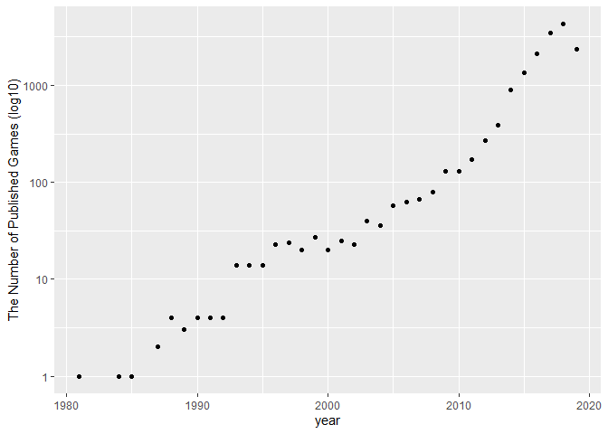
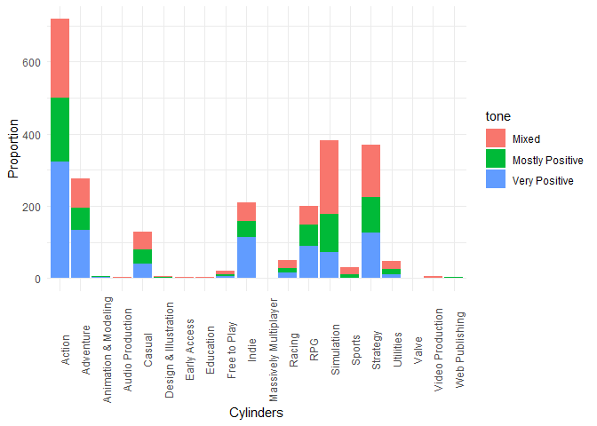
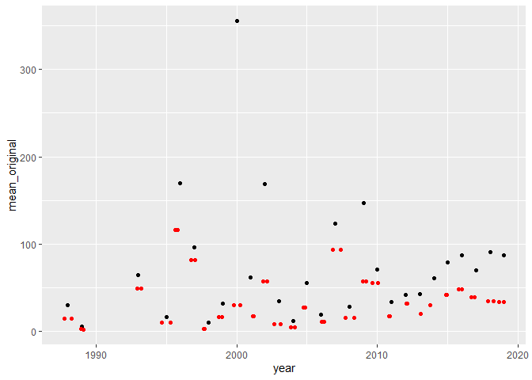

**Version 1.1**

*To complete this milestone, edit this `.rmd` file directly. Fill in the
sections that are commented out with `<!--- start your work here--->`.
When you are done, make sure to knit to an `.md` file by changing the
YAML settings, before submitting a tagged release on canvas.*

Welcome back to your mini data analysis project!
================================================

This time, we will explore more in depth the concept of *tidy data*, and
hopefully investigate further into your research questions that you
defined in milestone 1.

Begin by loading your data and the tidyverse package below:

     #install.packages("tsibble")
     #install.packages("lubridate")
    library(datateachr) # <- contains the data you picked!
    library(tidyverse)
    library(lubridate)

Learning Objectives
===================

By the end of this milestone, you should:

-   Become familiar with manipulating and summarizing your data in
    tibbles using `dplyr`, with a research question in mind
-   Understand what *tidy* data is, and how to create it. In milestone
    3, we will explore when this might be useful
-   Generate a reproducible and clear report using R Markdown
-   Gain a greater understanding of how to use R to answer research
    questions about your data

**Things to keep in mind**

-   Remember to document your code, be explicit about what you are
    doing, and write notes in this markdown document when you feel that
    context is required. Create your analysis as if someone else will be
    reading it! **There will be 2.5 points reserved for reproducibility,
    readability, and repo organization.**

-   Before working on each task, you should always keep in mind the
    specific **research question** that you’re trying to answer.

Task 1: Process and summarize your data (15 points)
===================================================

From milestone 1, you should have an idea of the basic structure of your
dataset (e.g. number of rows and columns, class types, etc.). Here, we
will start investigating your data more in-depth using various `dplyr`
functions.

### 1.1 (2.5 points)

First, write out the 4 research questions you defined in milestone 1
were. This will guide your work through milestone 2:

<!-------------------------- Start your work below ---------------------------->

1.  Question1: What’s the trend of the number of published games in
    recent years?

2.  Question2: Which genre does customers prefer? (i.e. the distribution
    of the number of positive reviews vs genres)

3.  Question3: If a game is discounted, is it more likely to be a “bad
    quality” game, in another word, do discounted games received more
    negative reviews comparing original-price games?

4.  Question4: How many achievements in a game do customers prefer?

<!----------------------------------------------------------------------------->

### 1.2 (10 points)

Now, for each of your four research questions, choose one task from
options 1-4 (summarizing), and one other task from 4-8 (graphing). You
should have 2 tasks done for each research question (8 total). Make sure
it makes sense to do them! (e.g. don’t use a numerical variables for a
task that needs a categorical variable.). Comment on why each task helps
(or doesn’t!) answer the corresponding research question.

Ensure that the output of each operation is printed!

**Summarizing:**

1.  Compute the *range*, *mean*, and *two other summary statistics* of
    **one numerical variable** across the groups of **one categorical
    variable** from your data.
2.  Compute the number of observations for at least one of your
    categorical variables. Do not use the function `table()`!
3.  Create a categorical variable with 3 or more groups from an existing
    numerical variable. You can use this new variable in the other
    tasks! *An example: age in years into “child, teen, adult, senior”.*
4.  Based on two categorical variables, calculate two summary statistics
    of your choosing.

**Graphing:**

1.  Create a graph out of summarized variables that has at least two
    geom layers.
2.  Create a graph of your choosing, make one of the axes logarithmic,
    and format the axes labels so that they are “pretty” or easier to
    read.
3.  Make a graph where it makes sense to customize the alpha
    transparency.
4.  Create 3 histograms out of summarized variables, with each histogram
    having different sized bins. Pick the “best” one and explain why it
    is the best.

Make sure it’s clear what research question you are doing each operation
for!

<!------------------------- Start your work below ----------------------------->

-   q1. What’s the trend of the number of published games in recent
    years?

First I need to compute how many games were published in each year,
corresponding to task 2 for *summarizing*. It is a bit tricky because
the dates are given as strings, so I have to extract the years and store
them into int before starting works.

    nperyear <-steam_games %>%
      filter(!is.na(release_date)& as.matrix(release_date)!="NaN")%>%  #remove all rows with NA or NaN values
       mutate(year=strtoi(unlist(strsplit(release_date,","))[2*(1:length(release_date)) ])) %>%#Since all date are given by string, in form of "May 12, 2016". I first split the date into 2 strings separated by ",", then store the even to a new variable "year".
       filter(year<=2019)%>%  #Since games published after 2020 maybe not well collected, so I filter out all games after 2020
       group_by(year)%>%
       summarise(n=n())

    ## `summarise()` ungrouping output (override with `.groups` argument)

    nperyear

    ## # A tibble: 36 x 2
    ##     year     n
    ##    <int> <int>
    ##  1  1981     1
    ##  2  1984     1
    ##  3  1985     1
    ##  4  1987     2
    ##  5  1988     4
    ##  6  1989     3
    ##  7  1990     4
    ##  8  1991     4
    ##  9  1992     4
    ## 10  1993    14
    ## # ... with 26 more rows

Second, I’d like to plot a graph to show the relationship between years
and the number of published games each year. By graphing out the trend,
I found that the increment over years is exponential, so it makes sense
to scale the number of published games by *log10*, corresponging to task
6 in *graphing*.

     nperyear %>%
       ggplot(aes(x=year, y=n)) +
       geom_point() +
       scale_y_log10() +
       ylab("The Number of Published Games (log10)")

+q2. Which genre does customers prefer? (i.e. the distribution of the
number of positive reviews vs genres)

++ First I need to create a categorical variable named *tone* to store
the tone of reviews from variable *all\_reviews*. There will be three
groups: “very-positive(more than 80% positive reviews)”, “mostly
positive (more than 80% positive reviews)” and “Mixed reviews (more than
80% positive reviews)”. It’s corresponding to task 3 in *summarizing*,
although the *all\_reviews* variable is not a numerical variable, the
same process need to be done here so I believe the work here is close to
the task 3.

    tones <-steam_games %>%
    # remove all lines that is "NA" or "NaN" in all_reviews
      filter(!is.na(all_reviews)& as.matrix(all_reviews)!="NaN") %>% 
       select(name,genre,all_reviews)%>% 
    # There are 3 groups based on the *all_reviews* variable
       mutate(
        tone = case_when(
          str_detect(all_reviews, "Very Positive") ~ "Very Positive",
          str_detect(all_reviews, "Mostly Positive") ~ "Mostly Positive",
          str_detect(all_reviews, "Mixed") ~ "Mixed"
        )
      )
    tones

    ## # A tibble: 28,470 x 4
    ##    name          genre                 all_reviews                      tone    
    ##    <chr>         <chr>                 <chr>                            <chr>   
    ##  1 DOOM          Action                Very Positive,(42,550),- 92% of~ Very Po~
    ##  2 PLAYERUNKNOW~ Action,Adventure,Mas~ Mixed,(836,608),- 49% of the 83~ Mixed   
    ##  3 BATTLETECH    Action,Adventure,Str~ Mostly Positive,(7,030),- 71% o~ Mostly ~
    ##  4 DayZ          Action,Adventure,Mas~ Mixed,(167,115),- 61% of the 16~ Mixed   
    ##  5 EVE Online    Action,Free to Play,~ Mostly Positive,(11,481),- 74% ~ Mostly ~
    ##  6 Devil May Cr~ Action                Very Positive,(9,645),- 92% of ~ Very Po~
    ##  7 Human: Fall ~ Adventure,Indie       Very Positive,(23,763),- 91% of~ Very Po~
    ##  8 They Are Bil~ Strategy,Early Access Very Positive,(12,127),- 85% of~ Very Po~
    ##  9 Warhammer: C~ Action,Adventure,RPG  Mixed,(904),- 44% of the 904 us~ Mixed   
    ## 10 For The King  Adventure,Indie,RPG,~ Very Positive,(4,600),- 83% of ~ Very Po~
    ## # ... with 28,460 more rows

++ Then, I need to plot the relationship between tones and genres. I set
the tones as the factor and genre as variable, I could be able to plot
it in the way that use 3 geom\_bar layers to plot three tones one by
one, but this code does the same thing, so I assume this is close to
task 5 in *graphing*.

     genre_reviews <-tones %>%
       filter(!str_detect(genre,",")& ! is.na(tone)) %>% # remove games that have more thna one genres
       group_by(genre,tone) 
    genre_reviews%>%
       ggplot(aes(factor(tone))) +
      geom_bar(aes(x=genre, fill = tone, group = tone), 
               position = "stack") +
      scale_fill_discrete("tone") +
      labs(y = "Proportion", x = "Cylinders") +
      theme_minimal() +
       theme(axis.text.x = element_text(angle=90))  # Rotate texts on X-axis to avoiding texts overlapping.

-   q3 : If a game is discounted, is it more likely to be a “bad
    quality” game, in another word, do discounted games received more
    negative reviews comparing original-price games?

++ To answer this question, first, I need to compute the *range*,
*mean*, *median* and *quantile (0.1,0.9)* across years as task 4 of
*summarizing*.

    games_withyear <-steam_games %>%    #Explained before
      filter(!is.na(release_date)& as.matrix(release_date)!="NaN")%>%  #remove all rows with NA or NaN values
       mutate(year=strtoi(unlist(strsplit(release_date,","))[2*(1:length(release_date)) ])) %>%#Since all date are given by string, in form of "May 12, 2016". I first split the date into 2 strings separated by ",", then store the even to a new variable "year".
       filter(year<=2019)

    discounted<-games_withyear %>% 
        filter( !is.na(original_price)  & as.matrix(original_price)!=0)  %>% #remove games those missing price information
        filter(as.matrix(discount_price)<=as.matrix(original_price))  %>%
       group_by(year) %>%
       summarise(mean_original = mean(original_price),
                 min_original=min(original_price), 
                 max_original=max(original_price),
                 median_original=median(original_price),
                 qs_original = quantile(original_price, c(0.25, 0.75)),
                 mean_discount = mean(discount_price))

    ## `summarise()` regrouping output by 'year' (override with `.groups` argument)

    discounted

    ## # A tibble: 56 x 7
    ## # Groups:   year [28]
    ##     year mean_original min_original max_original median_original qs_original
    ##    <int>         <dbl>        <dbl>        <dbl>           <dbl>       <dbl>
    ##  1  1988         30.0         30.0         30.0            30.0        30.0 
    ##  2  1988         30.0         30.0         30.0            30.0        30.0 
    ##  3  1989          5.99         5.99         5.99            5.99        5.99
    ##  4  1989          5.99         5.99         5.99            5.99        5.99
    ##  5  1993         64.9         64.9         64.9            64.9        64.9 
    ##  6  1993         64.9         64.9         64.9            64.9        64.9 
    ##  7  1995         16.4          2.99        40.0            13.9         9.99
    ##  8  1995         16.4          2.99        40.0            13.9        15.0 
    ##  9  1996        169.           1.99       502.             86.8         3.49
    ## 10  1996        169.           1.99       502.             86.8       253.  
    ## # ... with 46 more rows, and 1 more variable: mean_discount <dbl>

++ To visualize the means of original-prices and discount-prices over
years, I can plot them in a graph, which correspongding to task 5 in
*graphing*.

    (discounted %>%
       ggplot()+
       geom_point(aes(x=year,y=mean_original))  +
       geom_jitter(aes(x=year,y=mean_discount),color='red'))

-   q4: How many achievements in a game do customers prefer? ++ First, I
    need to have a brief exploration of the “achievements” variables, I
    am going to compute the *range*, *mean*, and *median* and *quantile
    (0.1,0.9)* across different games(i.e. game *name* as categorical
    variable) as task 4 of *summarizing*.

<!-- -->

    (achievement_stat <- steam_games %>%
       select(name, achievements)%>%
      filter(!is.na(achievements)& as.matrix(achievements)!="NaN")%>%  #remove all rows with NA or NaN element
       summarise(mean = mean(achievements),
                 min=min(achievements), 
                 max=max(achievements),
                 median=median(achievements),
                 qs = quantile(achievements, c(0.1, 0.9)) ))

    ## # A tibble: 2 x 5
    ##    mean   min   max median    qs
    ##   <dbl> <dbl> <dbl>  <dbl> <dbl>
    ## 1  77.2     1  9821     21     7
    ## 2  77.2     1  9821     21    63

With the output, I know that the average number of achievements is
around 77, while most games have 12-38 achievements. Some rare cases
(i.e. a game has more than thousands of achievements) raised up the
average number of achievements.

++ To visualize the achievements distribution, I will graph histogram.
As required in task 8, I will create 3 histograms out of summarized
variables with binwidth =1, 10, 20.

    # binwidth=1
    steam_games %>%
       filter(achievements<100)%>% #Since the 95% of the number of achievements are under 100,so I removed all rows that have more than 100 achievements.
       ggplot(aes(x=achievements)) +
       geom_histogram(binwidth = 1) 

    # binwidth=10
    steam_games %>%
       filter(achievements<100)%>% #Since the 95% of the number of achievements are under 100,so I removed all rows that have more than 100 achievements.
       ggplot(aes(x=achievements)) +
       geom_histogram(binwidth = 10) 

    # binwidth=20
    steam_games %>%
       filter(achievements<100)%>% #Since the 95% of the number of achievements are under 100,so I removed all rows that have more than 100 achievements.
       ggplot(aes(x=achievements)) +
       geom_histogram(binwidth = 20) 

We could see binwidth=1 is too small so that it shows more information
than needed, and binwidth=20 is too large so that it ignores a lot
details.

<!----------------------------------------------------------------------------->

### 1.3 (2.5 points)

Based on the operations that you’ve completed, how much closer are you
to answering your research questions? Think about what aspects of your
research questions remain unclear. Can your research questions be
refined, now that you’ve investigated your data a bit more? Which
research questions are yielding interesting results?

<!------------------------- Write your answer here ---------------------------->

-   How much closer are you to answering your research questions?

My results well answered my questions one, two and fur. The result of
question three still cannot answer it, because the resulted graph can
only show what portions of price that games discounted, instead of
showing the relationships between reviews and discounted games. Further
works need to be done to reveal those relationships.

-   What aspects of your research questions remain unclear?

The relationship between reviews and original/discounted games is still
unclear. The variable *discount price* itself is a bit ambiguous: *NA*
in *discount price* may represent that the game didn’t have a discount,
also could represent a missing data; and even some discount\_prices are
higher than their original\_prices, so the comparison between
original-price and discount-price cannot clearly show discounting
information.

+Now can your research questions be refined?

I’d like to refine question three to avoid using the variable *discount
price*. Maybe a question like “Is there any relationship between price
and the number of achievement” will be much more clear to answer.

+Any interesting findings?

Some of my questions are asking about the relationships between reviews
and a feature of games.There might be many causes resulting in a
negative reviews, so the trends or relationships I found above might be
misled by some undiscovered reasons.

<!----------------------------------------------------------------------------->

Task 2: Tidy your data (12.5 points)
====================================

In this task, we will do several exercises to reshape our data. The goal
here is to understand how to do this reshaping with the `tidyr` package.

A reminder of the definition of *tidy* data:

-   Each row is an **observation**
-   Each column is a **variable**
-   Each cell is a **value**

*Tidy’ing* data is sometimes necessary because it can simplify
computation. Other times it can be nice to organize data so that it can
be easier to understand when read manually.

### 2.1 (2.5 points)

Based on the definition above, can you identify if your data is tidy or
untidy? Go through all your columns, or if you have &gt;8 variables,
just pick 8, and explain whether the data is untidy or tidy.

<!--------------------------- Start your work below --------------------------->

Based on my research questions, I will choose 8 related columns for
tasks in this part.

    (eight_columns <-steam_games %>%
       select(id,name,genre, achievements,release_date,developer,original_price,discount_price))

    ## # A tibble: 40,833 x 8
    ##       id name  genre achievements release_date developer original_price
    ##    <dbl> <chr> <chr>        <dbl> <chr>        <chr>              <dbl>
    ##  1     1 DOOM  Acti~           54 May 12, 2016 id Softw~           20.0
    ##  2     2 PLAY~ Acti~           37 Dec 21, 2017 PUBG Cor~           30.0
    ##  3     3 BATT~ Acti~          128 Apr 24, 2018 Harebrai~           40.0
    ##  4     4 DayZ  Acti~           NA Dec 13, 2018 Bohemia ~           45.0
    ##  5     5 EVE ~ Acti~           NA May 6, 2003  CCP                  0  
    ##  6     6 Gran~ Acti~           NA NaN          Rockstar~           NA  
    ##  7     7 Devi~ Acti~           51 Mar 7, 2019  CAPCOM C~           60.0
    ##  8     8 Huma~ Adve~           55 Jul 22, 2016 No Brake~           15.0
    ##  9     9 They~ Stra~           34 Dec 12, 2017 Numantia~           30.0
    ## 10    10 Warh~ Acti~           43 May 31, 2019 Eko Soft~           50.0
    ## # ... with 40,823 more rows, and 1 more variable: discount_price <dbl>

My data is untidy:

In *genre* column, each cell might contain more than one “value”, for
example, if a game belongs to *action*, *adventure* and *strategy*, its
cell will store “Action,Adventure,Strategy”.
<!----------------------------------------------------------------------------->

### 2.2 (5 points)

Now, if your data is tidy, untidy it! Then, tidy it back to it’s
original state.

If your data is untidy, then tidy it! Then, untidy it back to it’s
original state.

Be sure to explain your reasoning for this task. Show us the “before”
and “after”.

<!--------------------------- Start your work below --------------------------->

-   Before tidying:

<!-- -->

    print(eight_columns,options(pillar.min_chars = Inf))

    ## # A tibble: 40,833 x 8
    ##       id name  genre achievements release_date developer original_price
    ##    <dbl> <chr> <chr>        <dbl> <chr>        <chr>              <dbl>
    ##  1     1 DOOM  Acti~           54 May 12, 2016 id Softw~           20.0
    ##  2     2 PLAY~ Acti~           37 Dec 21, 2017 PUBG Cor~           30.0
    ##  3     3 BATT~ Acti~          128 Apr 24, 2018 Harebrai~           40.0
    ##  4     4 DayZ  Acti~           NA Dec 13, 2018 Bohemia ~           45.0
    ##  5     5 EVE ~ Acti~           NA May 6, 2003  CCP                  0  
    ##  6     6 Gran~ Acti~           NA NaN          Rockstar~           NA  
    ##  7     7 Devi~ Acti~           51 Mar 7, 2019  CAPCOM C~           60.0
    ##  8     8 Huma~ Adve~           55 Jul 22, 2016 No Brake~           15.0
    ##  9     9 They~ Stra~           34 Dec 12, 2017 Numantia~           30.0
    ## 10    10 Warh~ Acti~           43 May 31, 2019 Eko Soft~           50.0
    ## # ... with 40,823 more rows, and 1 more variable: discount_price <dbl>

I set“options(pillar.min\_chars = Inf)” to print the entire string in
each column, it works well when I ran it in console, however, when I
output it as .md file, it cannot be show as entire string. I have no
idea why the console and markdown file give different results, I
searched online and somebody said it is related to Rstudio environment
and profiles. So I manually show it below. I know it’s not reproducible
but I believe this problem is out of the scope of STAT545.

id name genre  
<dbl> <chr> <chr>  
1 DOOM Action  
2 PLAYERUNKNOWN’S BATTLEGROUNDS Action,Adventure,Massively Multiplayer  
3 BATTLETECH Action,Adventure,Strategy

We can see in column *genre* of rows 2,3,4 and 5,the cells contain more
than a “value”, which makes it not a tidy data.

-   After tidying:

<!-- -->

    tidy_data1 <- eight_columns %>%
       separate_rows(genre, convert = TRUE) # separate_rows is a function included in tidyr
    print(tidy_data1,options(pillar.min_chars = Inf))

    ## # A tibble: 119,061 x 8
    ##       id name  genre achievements release_date developer original_price
    ##    <dbl> <chr> <chr>        <dbl> <chr>        <chr>              <dbl>
    ##  1     1 DOOM  Acti~           54 May 12, 2016 id Softw~           20.0
    ##  2     2 PLAY~ Acti~           37 Dec 21, 2017 PUBG Cor~           30.0
    ##  3     2 PLAY~ Adve~           37 Dec 21, 2017 PUBG Cor~           30.0
    ##  4     2 PLAY~ Mass~           37 Dec 21, 2017 PUBG Cor~           30.0
    ##  5     2 PLAY~ Mult~           37 Dec 21, 2017 PUBG Cor~           30.0
    ##  6     3 BATT~ Acti~          128 Apr 24, 2018 Harebrai~           40.0
    ##  7     3 BATT~ Adve~          128 Apr 24, 2018 Harebrai~           40.0
    ##  8     3 BATT~ Stra~          128 Apr 24, 2018 Harebrai~           40.0
    ##  9     4 DayZ  Acti~           NA Dec 13, 2018 Bohemia ~           45.0
    ## 10     4 DayZ  Adve~           NA Dec 13, 2018 Bohemia ~           45.0
    ## # ... with 119,051 more rows, and 1 more variable: discount_price <dbl>

id name genre  
<dbl> <chr> <chr>  
1 DOOM Action  
2 PLAYERUNKNOWN’S BATTLEGROUNDS Action 2 PLAYERUNKNOWN’S BATTLEGROUNDS
Adventure 2 PLAYERUNKNOWN’S BATTLEGROUNDS Massively Multiplayer  
3 BATTLETECH Action 3 BATTLETECH Adventure  
3 BATTLETECH Strategy

We can see that those cells are separated into multiple rows. Now, each
cell contains only one “value”, which make data tidier than before.

To untidy it back to original state:

    tidy_data2 <- tidy_data1 %>%
       group_by(id,name, achievements,release_date,developer,original_price,discount_price) %>% 
       summarise(genre  = paste(genre, collapse =","))

    ## `summarise()` regrouping output by 'id', 'name', 'achievements', 'release_date', 'developer', 'original_price' (override with `.groups` argument)

    print(tidy_data2,options(pillar.min_chars = Inf))

    ## # A tibble: 40,833 x 8
    ## # Groups:   id, name, achievements, release_date, developer, original_price
    ## #   [40,833]
    ##       id name  achievements release_date developer original_price discount_price
    ##    <dbl> <chr>        <dbl> <chr>        <chr>              <dbl>          <dbl>
    ##  1     1 DOOM            54 May 12, 2016 id Softw~           20.0           15.0
    ##  2     2 PLAY~           37 Dec 21, 2017 PUBG Cor~           30.0           NA  
    ##  3     3 BATT~          128 Apr 24, 2018 Harebrai~           40.0           NA  
    ##  4     4 DayZ            NA Dec 13, 2018 Bohemia ~           45.0           NA  
    ##  5     5 EVE ~           NA May 6, 2003  CCP                  0             NA  
    ##  6     6 Gran~           NA NaN          Rockstar~           NA             35.2
    ##  7     7 Devi~           51 Mar 7, 2019  CAPCOM C~           60.0           70.4
    ##  8     8 Huma~           55 Jul 22, 2016 No Brake~           15.0           17.6
    ##  9     9 They~           34 Dec 12, 2017 Numantia~           30.0           NA  
    ## 10    10 Warh~           43 May 31, 2019 Eko Soft~           50.0           NA  
    ## # ... with 40,823 more rows, and 1 more variable: genre <chr>

The tibble here is untidied back to original state (the *genre* column
is placed at the most right side).

<!----------------------------------------------------------------------------->

### 2.3 (5 points)

Now, you should be more familiar with your data, and also have made
progress in answering your research questions. Based on your interest,
and your analyses, pick 2 of the 4 research questions to continue your
analysis in milestone 3, and explain your decision.

Try to choose a version of your data that you think will be appropriate
to answer these 2 questions in milestone 3. Use between 4 and 8
functions that we’ve covered so far (i.e. by filtering, cleaning,
tidy’ing, dropping irrelvant columns, etc.). Save this tibble as an
`.RDS` object with the function `saveRDS()`.

<!--------------------------- Start your work below --------------------------->

I ’d like to choose question one and two to continue your analysis in
milestone 3. + Question1: What’s the trend of the number of published
games in recent years?

-   Question2: Which genre does customers prefer?

I make my\_data as the version of dataset that I will use in milestone
3.

    my_data <-steam_games %>%
       filter(!is.na(all_reviews) &!is.na(release_date)& as.matrix(release_date)!="NaN")%>%  #remove all rows with NA or NaN values
       separate_rows(genre, convert = TRUE) %>%
       mutate(tone = case_when(str_detect(all_reviews, "Very Positive") ~ "Very Positive",
                               str_detect(all_reviews, "Mostly Positive") ~ "Mostly Positive",
                               str_detect(all_reviews, "Mixed") ~ "Mixed") ) %>%
       select(id,name,genre, tone,release_date,achievements,developer,original_price,discount_price) 
    saveRDS(my_data,file="my_data")

<!----------------------------------------------------------------------------->

*When you are done, knit an `md` file. This is what we will mark! Make
sure to open it and check that everything has knitted correctly before
submitting your tagged release.*
