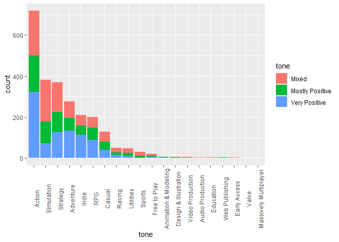

**Milestone leader**: Vincenzo

**Deadline**: Saturday, October 24 at 23:59 PST

Welcome to your last milestone in your mini data analysis project!
==================================================================

In Milestone 1, you explored your data and came up with research
questions. In Milestone 2, you obtained some results by making summary
tables and graphs.

In this (3rd) milestone, you’ll be sharpening some of the results you
obtained from your previous milestone by:

-   Manipulating special data types in R: factors and/or dates and
    times.
-   Fitting a model object to your data, and extract a result.
-   Reading and writing data as separate files.

Instructions
------------

**To complete this milestone**, edit this very `.Rmd` file directly.
Fill in the sections that are tagged with
`<!--- start your work here--->`.

**To submit this milestone**, make sure to knit this `.Rmd` file to an
`.md` file by changing the YAML output settings from
`output: html_document` to `output: github_document`. Commit and push
all of your work to your mini-analysis GitHub repository, and tag a
release on GitHub. Then, submit a link to your tagged release on canvas.

**Points**: This milestone is worth 40 points (compared to the usual 30
points): 30 for your analysis, and 10 for your entire mini-analysis
GitHub repository. Details follow.

**Research Questions**: In Milestone 2, you chose two research questions
to focus on. Wherever realistic, your work in this milestone should
relate to these research questions whenever we ask for justification
behind your work. In the case that some tasks in this milestone don’t
align well with one of your research questions, feel free to discuss
your results in the context of a different research question.

Setup
=====

Begin by loading your data and the tidyverse package below:

    library(datateachr) # <- contains the data you picked!
    library(tidyverse)
    library(broom)
    library(lubridate)

From Milestone 2, you chose two research questions. What were they? Put
them here.

<!-------------------------- Start your work below ---------------------------->

1.  Which genre does customers prefer?

2.  What’s the trend of the number of published games in recent years?
    <!----------------------------------------------------------------------------->

Exercise 1: Special Data Types (10)
===================================

For this exercise, you’ll be choosing two of the three tasks below –
both tasks that you choose are worth 5 points each.

But first, tasks 1 and 2 below ask you to modify a plot you made in a
previous milestone. The plot you choose should involve plotting across
at least three groups (whether by facetting, or using an aesthetic like
colour). Place this plot below (you’re allowed to modify the plot if
you’d like). If you don’t have such a plot, you’ll need to make one.
Place the code for your plot below.

<!-------------------------- Start your work below ---------------------------->

    # Repeated work from milestone 2
    tones <-steam_games %>%
      filter(!is.na(all_reviews)& as.matrix(all_reviews)!="NaN") %>% 
       select(name,genre,all_reviews)%>% 
       mutate(
        tone = case_when(
          str_detect(all_reviews, "Very Positive") ~ "Very Positive",
          str_detect(all_reviews, "Mostly Positive") ~ "Mostly Positive",
          str_detect(all_reviews, "Mixed") ~ "Mixed"
        )
      )
     genre_reviews <-tones %>%
       filter(!str_detect(genre,",")& ! is.na(tone)) %>% 
       group_by(genre,tone) 
    # The plot in milestone 2
    genre_reviews%>%
       ggplot(aes(factor(tone))) +
      geom_bar(aes(x=genre, fill = tone, group = tone), 
               position = "stack") +
      scale_fill_discrete("tone") +
       theme(axis.text.x = element_text(angle=90))  # Rotate texts on X-axis to avoiding texts overlapping.

<!----------------------------------------------------------------------------->

Now, choose two of the following tasks.

1.  Produce a new plot that reorders a factor in your original plot,
    using the `forcats` package (3 points). Then, in a sentence or two,
    briefly explain why you chose this ordering (1 point here for
    demonstrating understanding of the reordering, and 1 point for
    demonstrating some justification for the reordering, which could be
    subtle or speculative.)

2.  Produce a new plot that groups some factor levels together into an
    “other” category (or something similar), using the `forcats` package
    (3 points). Then, in a sentence or two, briefly explain why you
    chose this grouping (1 point here for demonstrating understanding of
    the grouping, and 1 point for demonstrating some justification for
    the grouping, which could be subtle or speculative.)

3.  If your data has some sort of time-based column like a date (but
    something more granular than just a year):

    1.  Make a new column that uses a function from the `lubridate` or
        `tsibble` package to modify your original time-based column. (3
        points)
        -   Note that you might first have to *make* a time-based column
            using a function like `ymd()`, but this doesn’t count.
        -   Examples of something you might do here: extract the day of
            the year from a date, or extract the weekday, or let 24
            hours elapse on your dates.
    2.  Then, in a sentence or two, explain how your new column might be
        useful in exploring a research question. (1 point for
        demonstrating understanding of the function you used, and 1
        point for your justification, which could be subtle or
        speculative).
        -   For example, you could say something like “Investigating the
            day of the week might be insightful because penguins don’t
            work on weekends, and so may respond differently”.

<!-------------------------- Start your work below ---------------------------->

**Task Number**: 1

    genre_reviews%>% 
       ggplot(aes(tone)) +
      geom_bar(aes(x=fct_infreq(genre), fill = tone, group = tone), #using the `forcats` package: fct_infreq
               position = "stack") +
      scale_fill_discrete("tone") +
       theme(axis.text.x = element_text(angle=90))  # Rotate texts on X-axis to avoiding texts overlapping.

By reordered the x axis in frequency, the figure is much more clear and
readable. It is easier to compare between various genres, for example,
it is obvious that “Strategy” games received more “Very Positive”
reviews than “Simulation” games after fct\_infreq the x axis.

<!----------------------------------------------------------------------------->
<!-------------------------- Start your work below ---------------------------->

**Task Number**: 3

    extractyear <-steam_games %>%
      filter(!is.na(release_date)& release_date!="NaN")%>% 
      mutate(year=lubridate::year(mdy(release_date)))

    ## Warning: Problem with `mutate()` input `year`.
    ## i  1235 failed to parse.
    ## i Input `year` is `lubridate::year(mdy(release_date))`.

    ## Warning: 1235 failed to parse.

When exploring the trend of the number of released games, it is obvious
that we ’d like to know how many games were released in each year. The
day and month is useless here, for example it doesn’t matter a game was
released in January or February, so I extracted the year from a date. To
do that, I converted the original strings (like “May 12, 2016”) to a
standard form of date in “lubridate” with mdy(), then extracted year
with “year()”.

<!----------------------------------------------------------------------------->

Exercise 2: Modelling
=====================

2.0 (no points)
---------------

Pick a research question, and pick a variable of interest (we’ll call it
“Y”) that’s relevant to the research question. Indicate these.

<!-------------------------- Start your work below ---------------------------->

**Research Question**: What’s the trend of the number of published games
in recent years?

**Variable of interest**: How many games will be published in 2020 -
2025?

<!----------------------------------------------------------------------------->

2.1 (5 points)
--------------

Fit a model or run a hypothesis test that provides insight on this
variable with respect to the research question. Store the model object
as a variable, and print its output to screen. We’ll omit having to
justify your choice, because we don’t expect you to know about model
specifics in STAT 545.

-   **Note**: It’s OK if you don’t know how these models/tests work.
    Here are some examples of things you can do here, but the sky’s the
    limit.
    -   You could fit a model that makes predictions on Y using another
        variable, by using the `lm()` function.
    -   You could test whether the mean of Y equals 0 using `t.test()`,
        or maybe the mean across two groups are different using
        `t.test()`, or maybe the mean across multiple groups are
        different using `anova()` (you may have to pivot your data for
        the latter two).
    -   You could use `lm()` to test for significance of regression.

<!-------------------------- Start your work below ---------------------------->

    nperyear <-extractyear %>%
       filter(year<=2019)%>%  #Since games published after 2020 maybe not well collected, so I filter out all games after 2020
       group_by(year)%>%
       summarise(n=n())

    ## `summarise()` ungrouping output (override with `.groups` argument)

    fit <- lm(log(n) ~ year,data=nperyear)  # The increment is close to a exponential function
    augment(fit)

    ## # A tibble: 38 x 7
    ##    `log(n)`  year .fitted .std.resid   .hat .sigma .cooksd
    ##       <dbl> <dbl>   <dbl>      <dbl>  <dbl>  <dbl>   <dbl>
    ##  1    0      1981  -0.347      0.667 0.109   0.555 0.0271 
    ##  2    0      1983   0.113     -0.215 0.0926  0.558 0.00235
    ##  3    0.693  1984   0.343      0.665 0.0852  0.555 0.0206 
    ##  4    0      1985   0.572     -1.08  0.0783  0.550 0.0497 
    ##  5    0      1986   0.802     -1.51  0.0718  0.541 0.0883 
    ##  6    1.39   1987   1.03       0.665 0.0657  0.555 0.0156 
    ##  7    1.61   1988   1.26       0.651 0.0601  0.555 0.0135 
    ##  8    1.79   1989   1.49       0.560 0.0549  0.556 0.00911
    ##  9    2.20   1990   1.72       0.886 0.0501  0.553 0.0207 
    ## 10    2.08   1991   1.95       0.238 0.0458  0.558 0.00136
    ## # ... with 28 more rows

<!----------------------------------------------------------------------------->

2.2 (5 points)
--------------

Produce something relevant from your fitted model: either predictions on
Y, or a single value like a regression coefficient or a p-value.

-   Be sure to indicate in writing what you chose to produce.
-   Your code should either output a tibble (in which case you should
    indicate the column that contains the thing you’re looking for), or
    the thing you’re looking for itself.
-   Obtain your results using the `broom` package if possible. If your
    model is not compatible with the broom function you’re needing, then
    you can obtain your results by some other means, but first indicate
    which broom function is not compatible.

<!-------------------------- Start your work below ---------------------------->

    year_predicted <-tibble(year = seq(2020,2025))
    (prediction <- augment(fit, newdata = year_predicted) %>%
      mutate(NumberofGames_predicted=exp(.fitted)))

    ## # A tibble: 6 x 3
    ##    year .fitted NumberofGames_predicted
    ##   <int>   <dbl>                   <dbl>
    ## 1  2020    8.62                   5522.
    ## 2  2021    8.85                   6948.
    ## 3  2022    9.08                   8744.
    ## 4  2023    9.31                  11003.
    ## 5  2024    9.54                  13846.
    ## 6  2025    9.77                  17423.

<!----------------------------------------------------------------------------->

I’d like to predict the number of published games in 2020 to 2025. My
result is shown as a tibble, in which the column “.fitted” contains the
predicted values by applying the model.The column
“NumberofGames\_predicted” is the exponential of the “.ffited” value,
since the trend of the number of published games over years is an
exponential function.

Exercise 3: Reading and writing data
====================================

Get set up for this exercise by making a folder called `output` in the
top level of your project folder / repository. You’ll be saving things
there.

3.1 (5 points)
--------------

Take a summary table that you made from Milestone 2 (Exercise 1.2), and
write it as a csv file in your `output` folder. Use the `here::here()`
function.

-   **Robustness criteria**: You should be able to move your Mini
    Project repository / project folder to some other location on your
    computer, or move this very Rmd file to another location within your
    project repository / folder, and your code should still work.
-   **Reproducibility criteria**: You should be able to delete the csv
    file, and remake it simply by knitting this Rmd file.

<!-------------------------- Start your work below ---------------------------->

    #install.packages("here")
    library(here)

    ## Warning: package 'here' was built under R version 4.0.3

    ## here() starts at C:/Users/苏子琪/Desktop/STAT545/Mini  data analysis/stat-545a-mini-data-analysis-Leosuziqi

    tones <-steam_games %>%
    # remove all lines that is "NA" or "NaN" in all_reviews
      filter(!is.na(all_reviews)& as.matrix(all_reviews)!="NaN") %>% 
       select(name,genre,all_reviews)%>% 
    # There are 3 groups based on the *all_reviews* variable
       mutate(
        tone = case_when(
          str_detect(all_reviews, "Very Positive") ~ "Very Positive",
          str_detect(all_reviews, "Mostly Positive") ~ "Mostly Positive",
          str_detect(all_reviews, "Mixed") ~ "Mixed"
        )
      )
    write_csv(tones, here("output", "tones.csv"))

<!----------------------------------------------------------------------------->

3.2 (5 points)
--------------

Write your model object from Exercise 2 to an R binary file (an RDS),
and load it again. Be sure to save the binary file in your `output`
folder. Use the functions `saveRDS()` and `readRDS()`.

-   The same robustness and reproducibility criteria as in 3.1 apply
    here.

<!-------------------------- Start your work below ---------------------------->

    saveRDS(prediction,here("output","prediction.rds"))
    prediction_reload <-readRDS(here("output","prediction.rds"))

<!----------------------------------------------------------------------------->

Tidy Repository
===============

Now that this is your last milestone, your entire project repository
should be organized. Here are the criteria we’re looking for.

Main README (3 points)
----------------------

There should be a file named `README.md` at the top level of your
repository. Its contents should automatically appear when you visit the
repository on GitHub.

Minimum contents of the README file:

-   In a sentence or two, explains what this repository is, so that
    future-you or someone else stumbling on your repository can be
    oriented to the repository.
-   In a sentence or two (or more??), briefly explains how to engage
    with the repository. You can assume the person reading knows the
    material from STAT 545A. Basically, if a visitor to your repository
    wants to explore your project, what should they know?

Once you get in the habit of making README files, and seeing more README
files in other projects, you’ll wonder how you ever got by without them!
They are tremendously helpful.

File and Folder structure (3 points)
------------------------------------

You should have at least four folders in the top level of your
repository: one for each milestone, and one output folder. If there are
any other folders, these are explained in the main README.

Each milestone document is contained in its respective folder, and
nowhere else.

Every level-1 folder (that is, the ones stored in the top level, like
“Milestone1” and “output”) has a `README` file, explaining in a sentence
or two what is in the folder, in plain language (it’s enough to say
something like “This folder contains the source for Milestone 1”).

Output (2 points)
-----------------

All output is recent and relevant:

-   All Rmd files have been `knit`ted to their output, and all data
    files saved from Exercise 3 above appear in the `output` folder.
-   All of these output files are up-to-date – that is, they haven’t
    fallen behind after the source (Rmd) files have been updated.
-   There should be no relic output files. For example, if you were
    knitting an Rmd to html, but then changed the output to be only a
    markdown file, then the html file is a relic and should be deleted.

Our recommendation: delete all output files, and re-knit each
milestone’s Rmd file, so that everything is up to date and relevant.

PS: there’s a way where you can run all project code using a single
command, instead of clicking “knit” three times. More on this in STAT
545B!

Error-free code (1 point)
-------------------------

This Milestone 3 document knits error-free. (We’ve already graded this
aspect for Milestone 1 and 2)

Tagged release (1 point)
------------------------

You’ve tagged a release for Milestone 3. (We’ve already graded this
aspect for Milestone 1 and 2)
